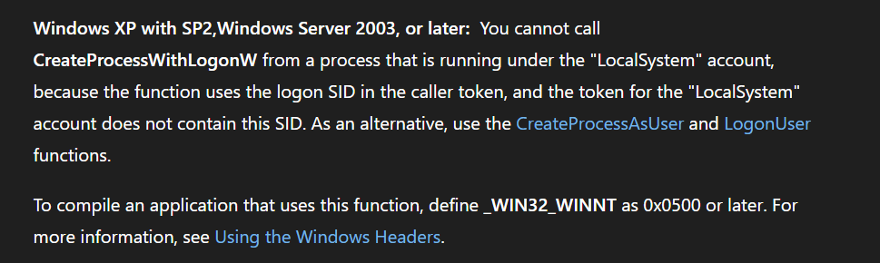

# Spoofing Parent Pid

## Background and Motivation

Recently I was implementing a remote PRT extraction tool designed to run in hybrid-joined Azure environments, where users from an on-premises Active Directory domain have some level of access to Azure AD resources. The idea was simple: build a variant of **PsExec** by replacing the embedded service with logic that scans running processes owned by normal users, steals their token, and runs the PRT extraction logic in a new thread. The flow is straightforward `OpenProcessToken` -> `DuplicateTokenEx` -> `ImpersonateLoggedOnUser` -> run PRT dump function -> `RevertToSelf`.

But I wanted to make the tool more complete by supporting arbitrary user credentials from the on-premises domain. In my lab I was using Password Hash Sync, so I could pass user credentials to get an interactive session using `CreateProcessWithLogonW`, supply a dummy command like `cmd /c timeout 5`, and give the **CloudAP** plugin just enough time to cache the PRT cookie into the new session. From there, I could steal the token from that session and extract the PRT cookie for the target user. This approach effectively allows PRT extraction for any on-premises user whose credentials are known.

There's just one problem as every Windows internals enthusiast knows, `CreateProcessWithLogonW` cannot be called from a SYSTEM context. Microsoft documents this explicitly:

> "You cannot call CreateProcessWithLogonW from a process that is running under the LocalSystem account, because the function uses the logon SID in the caller token, and the token for the LocalSystem account does not contain this SID."

Reference: [https://learn.microsoft.com/en-us/windows/win32/api/winbase/nf-winbase-createprocesswithlogonw](https://learn.microsoft.com/en-us/windows/win32/api/winbase/nf-winbase-createprocesswithlogonw)

<figure><figcaption></figcaption></figure>

My initial thought was simple: steal a token from a non-SYSTEM process, duplicate and impersonate it so the main thread runs under a normal user context, then call `CreateProcessWithLogonW`. That seemed reasonable until I hit an unexpected `ACCESS_DENIED` (0x5).

## Showcasing the Issue

At first I suspected a token impersonation problem maybe I wasn't duplicating or impersonating the token correctly. To investigate, I wrote a small C tool (`TokenDump`) that performs an extensive token dump covering integrity level, elevation type, privileges, groups, logon session, and token statistics. I ran the same binary from two sessions simultaneously:

* A **normal user session** (k.mori) that impersonates itself using the same procedure the SYSTEM session uses.
* A **SYSTEM session** that steals and impersonates the same k.mori token.

Both sessions dump the token information in detail side by side so I could compare them and determine if any flags or SIDs were being stripped.

Using the first version of the PoC from my repo with the extended debug header, the results were clear: from the normal user context the process spawned successfully, but from the SYSTEM context even though both sessions were impersonating a token with the same Auth ID the call returned `ACCESS_DENIED`.

<figure><figcaption></figcaption></figure>

## Tracing the Call Chain

Last year I was trying to build a BOF alternative to the native Windows `runas.exe`. I managed to implement it for logon type 9, which works like `make-token` in every C2 framework. The interesting part was the interactive session with logon type 2, where I discovered that `runas` under the hood calls `CreateProcessWithLogonW`. Since it spawns a whole new process, I figured there was no point building a BOF for that — just use RunasCs with execute-assembly and call it a day. But what I did take away from reversing `runas.exe` is the call chain: `CreateProcessWithLogonW` is just a wrapper that calls `CreateProcessWithLogonCommonW`, which prepares the arguments and passes them to the RPC stub that communicates with the seclogon service.

We can verify this by loading `advapi32.dll` into IDA and tracing the API call. We can see it forwards the same arguments and passes `0` as the first argument this appears to be a reserved parameter, likely because this API is called by several other functions internally that need that slot for different purpose

<figure><figcaption></figcaption></figure>

If we take a look at `CreateProcessWithTokenW`, we can see it calls the same internal function and passes a token handle as the first argument which explains why that slot is reserved rather than unused.

<figure><figcaption></figcaption></figure>

If we take a deeper look into `CreateProcessWithLogonCommonW`, we can see it calls `c_SeclCreateProcessWithLogonW`  the actual RPC client stub that marshals the request and sends it over to the seclogon service.

<figure><figcaption></figcaption></figure>

`c_SeclCreateProcessWithLogonW` is the RPC client stub that talks to the seclogon interface the service hosted in `svchost.exe`. It takes the bindings and the arguments that were collected and prepared by `CreateProcessWithLogonCommonW` and marshals them into an RPC call.

What `CreateProcessWithLogonCommonW` actually does is take the provided arguments, perform some validation checks, expand the command line to the full binary path on disk, prepare the environment block, and pack everything into a `_SECL_REQUEST` structure that the seclogon RPC server understands as an incoming request.

The layout of this structure can be recovered using tools like RpcView, or by referencing the ReactOS source where a lot of Windows internal structures have already been reversed. I also found an excellent piece of research on this exact topic where the author built a direct RPC client to talk to seclogon and spawn a process: [SecLogon-RPC](https://github.com/CarlosG13/SecLogon-RPC)

In that research, the author sets the process ID in the request structure to an arbitrary PID to spoof the parent from  `STARTUPINFOEX`  structure bug. From my earlier research into seclogon I also came across a great post by [SplinterCod3 ](https://splintercod3.blogspot.com/p/the-hidden-side-of-seclogon-part-3.html)where he uses a similar technique setting the PPID and stealing arbitrary handles from privileged processes like LSASS but via `PEB`.

At this point the issue was starting to become clear. There is a step where `c_SeclCreateProcessWithLogonW` embeds the caller's PID in this case `TokenDump.exe` into the RPC request and sends it to the seclogon server, which then tries to open that process. Notably, this `OpenProcess` call is not present on the client side it happens entirely within seclogon.

<figure><figcaption></figcaption></figure>

A quick reminder on how RPC servers work in general: the server impersonates the client token to perform tasks in the caller's security context. Since seclogon runs as SYSTEM, it needs to impersonate the caller to avoid doing everything as SYSTEM on behalf of arbitrary clients.

So here is what happens in our case: when we impersonate the `k.mori` token, the main thread drops the SYSTEM context and runs as `k.mori`. When the call reaches `c_SeclCreateProcessWithLogonW`, it goes out to seclogon as `k.mori`. The RPC server then impersonates us wearing the `k.mori` filtered token and uses that context to call `OpenProcess` on the `TokenDump.exe` process, which is owned by SYSTEM. A medium-integrity filtered token cannot open a SYSTEM-owned process with the requested access rights, so seclogon returns `ACCESS_DENIED` (0x5) back to the caller.

We can verify that seclogon does indeed call `OpenProcess` by loading `seclogon.dll` into IDA. We can see the RPC dispatcher `SeclCreateProcessWithLogonW` receiving the RPC call made by `c_SeclCreateProcessWithLogonW`, which then forwards execution to the actual worker function `SlrCreateProcessWithLogon`.

<figure><figcaption></figcaption></figure>

If we look at the worker function `SlrCreateProcessWithLogon`, we can clearly see it calls `RpcImpersonateClient` to impersonate the caller, then immediately calls `OpenProcess` on the PID that was embedded in the request structure confirming exactly what we suspected.

<figure><figcaption></figcaption></figure>

Inside `SlrCreateProcessWithLogon`, after `RpcImpersonateClient`, seclogon calls:

```c
OpenProcess(0x4C0, FALSE, dwProcessId);
```

`0x4C0` decomposes as:

```asm
0x400  PROCESS_QUERY_INFORMATION   -> read process token, PEB, exit code
0x040  PROCESS_DUP_HANDLE          -> duplicate handles from caller into child
0x080  PROCESS_CREATE_PROCESS      -> use caller as parent process (PPID)
       -----
0x4C0
```

This is why PPID spoofing is a free side effect seclogon explicitly requests `PROCESS_CREATE_PROCESS` on `dwProcessId`, meaning whatever PID you put in that field becomes the parent of the spawned process.

This is also exactly why the bypass works: by pointing `dwProcessId` at a user-owned process, the impersonated medium-integrity token can satisfy all three access rights on that process, and seclogon proceeds normally.

To summarize:


Thread impersonates filtered k.mori token
\
-> RPC call to seclogon with dwProcessId = TokenDump.exe PID
\
-> seclogon: RpcImpersonateClient() -> wearing filtered k.mori token
\
-> seclogon: OpenProcess(0x4C0, TokenDump.exe PID)
\
-> filtered medium token cannot open SYSTEM process
\
-> 0x00000005 ACCESS\_DENIED returned to caller


## Confirming with WinDbg

Now that the issue is clear, we need to step back and verify it dynamically. Since we control the client side, we need to figure out exactly how the arguments are packed before the RPC call goes out specifically, where the caller PID sits inside the marshaled `_SECL_REQUEST` structure. Once we have that offset, we can hook `CreateProcessWithLogonCommonW` at the call site of `c_SeclCreateProcessWithLogonW`, intercept the structure, and patch the caller PID to point to a process owned by `k.mori` instead of our SYSTEM-owned `TokenDump.exe`.

To recover the `_SECL_REQUEST` structure layout we can use [RpcView](https://github.com/silverf0x/RpcView).

```powershell
# to get the pid fo svchost.exe that hostes seclogon service
 (Get-CimInstance Win32_Service -Filter "Name='seclogon'").ProcessId
```

we can see to procedure are exposed by seclogon

<figure><figcaption></figcaption></figure>

Both callable procedures pack the request arguments into `struct Struct_204_t*`  this is definitively the RPC request structure that maps to `_SECL_REQUEST`.

```c
typedef struct Struct_204_t
	{
		struct Struct_44_t 	StructMember0;
		struct Struct_44_t 	StructMember1;
		struct Struct_44_t 	StructMember2;
		struct Struct_44_t 	StructMember3;
		struct Struct_44_t 	StructMember4;
		struct Struct_44_t 	StructMember5;
		struct Struct_114_t 	StructMember6;
		struct Struct_184_t 	StructMember7;
		long 	StructMember8;
		long 	StructMember9;
		long 	StructMember10;
		long 	StructMember11;
		long 	StructMember12;
		long 	StructMember13;
		hyper 	StructMember14;
		hyper 	StructMember15;
		hyper 	StructMember16;
	}Struct_204_t;
```

Cross-referencing with the ReactOS source, we can match `Struct_204_t` to the following structure:

```c
typedef struct _SECL_REQUEST
{
    [string] WCHAR *Username;
    [string] WCHAR *Domain;
    [string] WCHAR *Password;
    [string] WCHAR *ApplicationName;
    [string] WCHAR *CommandLine;
    [string] WCHAR *CurrentDirectory;
    [size_is(dwEnvironmentSize)] BYTE *Environment;
    DWORD dwEnvironmentSize;
    DWORD dwLogonFlags;
    DWORD dwCreationFlags;
    DWORD dwProcessId;
} SECL_REQUEST, *PSECL_REQUEST;
```

Since manually reversing the full structure is tedious, we can find the offset dynamically using WinDbg by following the call and inspecting the arguments at each stage. I added a `--sleep` flag to `TokenDump` to introduce a delay before `CreateProcessWithLogonW` is called, giving enough time to attach WinDbg to the process.

```powershell
.\TokenDump.exe -t k.mori -u 'REIKI-NO-MORI\k.kaneki' -p 'P@ssw0rd' --sleep 60000
```

<figure><figcaption></figcaption></figure>

I set three breakpoints in WinDbg here is a useful cheat sheet if you are not familiar with WinDbg commands: [windbg-cheat-sheet](https://github.com/repnz/windbg-cheat-sheet).

Note that our current process PID is `11616` (`0x2D60` in hex) keep this in mind as we will be looking for it in the structure dump shortly.

```asm
bp ADVAPI32!CreateProcessWithLogonW
bp ADVAPI32!CreateProcessWithLogonCommonW
bp ADVAPI32!c_SeclCreateProcessWithLogonW
```

Type `g` to resume execution and we hit the first breakpoint at `CreateProcessWithLogonW`. We can now inspect the argument values we passed to the function.


In Windows x64, the first four integer or pointer arguments to a function are passed in registers instead of on the stack: the first argument goes in `RCX`, the second in `RDX`, the third in `R8`, and the fourth in `R9`. If a function takes more than four arguments, the remaining ones are placed on the stack. When reversing code, this means that just before a `call`, the values loaded into those registers are usually the function’s first four parameters.


Following the x64 calling convention, the first argument (username) should be in `RCX`, the domain name in `RDX`, the password in `R8`, and since we did not explicitly set a logon flag, `R9` will just be `0` or garbage  that slot is effectively unused in this call.

<figure><figcaption></figcaption></figure>

```asm
du rcx
du rdx
du r8
du r9
```

<figure><figcaption></figcaption></figure>

We can clearly see the arguments are correct. We can also verify that this function forwards to `CreateProcessWithLogonCommonW` by disassembling it in WinDbg using the `u` command with an `Lxx` length parameter to see enough instructions.

```js
u ADVAPI32!CreateProcessWithLogonW L20
```

<figure><figcaption></figcaption></figure>

We can see the call clearly. Typing `g` again hits the second breakpoint at `CreateProcessWithLogonCommonW`. We can inspect its arguments and confirm that `RCX` is NULL the reserved first argument, consistent with what we observed in the static analysis.

<figure><figcaption></figcaption></figure>

This matches exactly what we found in the static analysis. We can also disassemble `CreateProcessWithLogonCommonW` in WinDbg to locate the call into `c_SeclCreateProcessWithLogonW`  though keep in mind this function is large, over 600 lines as we saw in IDA, so we need to scroll through a bit to find the call site.

<figure><figcaption></figcaption></figure>

we can see is preparing the args into rcx and rdx register 2 args as  we saw in IDA so we can record this pattern because we will need it later when we find where is the offset of the  caller pid in the rcx so that we can patch it befor passed into the call

```asm
// Call site pattern (verified Win11 26200, stable since Vista):
48 8D 94 24 40 02 00 00   LEA RDX,[RSP+240h]  <- SECL_RESPONSE ptr
48 8D 8C 24 30 01 00 00   LEA RCX,[RSP+130h]  <- SECL_REQUEST ptr
E8 xx xx xx xx            call c_SeclCreateProcessWithLogonW
```

Type `g` one more time and we finally hit the third breakpoint at `c_SeclCreateProcessWithLogonW`. We can now dump the raw 8-byte pointers and values from the `RCX` register using the `dq rcx L20` command to inspect the `_SECL_REQUEST` structure.

```asm
dq @rcx L40
```

<figure><figcaption></figcaption></figure>

Converting our current PID `11616` to hex gives `0x2D60` and we can see it clearly embedded in the WinDbg memory dump exactly where we expected it.

<figure><figcaption></figcaption></figure>

We can calculate the offset using a simple hex subtraction:

```asm
0x000000db2bbfda20 - 0x000000db2bbfd950 = 0xD0
```

This gives us the offset of the PID field as a `QWORD` at `0xD0`. However since we know the PID is a 32-bit value stored as the lower `DWORD`, the actual offset of the `dwProcessId` field is `0xD8`. We can verify this by reading the value at that offset and confirming it matches our PID.

```asm
dd @rcx+0xd8
```

<figure><figcaption></figcaption></figure>

Now we just need to pick a process owned by `k.mori` the easiest target is `explorer.exe`, visible in Process Hacker. We can then patch the `dwProcessId` field in WinDbg at offset `0xD8` from `RCX`.

In my case `explorer.exe` is running under `k.mori` with PID `5504` (`0x1580` in hex):

```asm
// to patch it
ed @rcx+d8 1580
// verify
dd @rcx+d8
```

<figure><figcaption></figcaption></figure>

Now just hit `g` and let's see the cmd fireing up.

<figure><figcaption></figcaption></figure>

And there it is  we successfully spawned an interactive session as `k.kaneki` using `CreateProcessWithLogonW` from a SYSTEM context, with the parent PID spoofed to `explorer.exe`. Root cause confirmed, hypothesis validated.

## hooking&#x20;

Now that we fully understand the calling mechanism, we can hook the call site of `c_SeclCreateProcessWithLogonW` inside `CreateProcessWithLogonCommonW` with a stub that patches `[RCX+0xD8]` to a user-owned PID before the RPC call fires.

The approach is straightforward: get the address of `CreateProcessWithLogonCommonW` via `GetProcAddress`, pattern-scan the function body to locate the exact call site of `c_SeclCreateProcessWithLogonW` using the byte pattern we copied earlier from WinDbg, allocate memory near advapi32 for our stub, and redirect execution into it. A simple stub to accomplish this is the following:

```asm
// Stub (27 bytes, allocated near advapi32 for E9 rel32 reach):
//   B8 xx xx xx xx       MOV EAX, spoofPid         <- patched at install
//   89 81 D8 00 00 00    MOV [RCX+0D8h], EAX       <- patch dwProcessId
//   FF 15 02 00 00 00    CALL [RIP+2]              <- preserves stack balance
//   EB 08                JMP over addr qword
//   xx xx xx xx xx xx xx xx  real c_Secl addr
```

I assembled all of this into a PoC you can find the full code in my GitHub repository: [seclogon-cpwlw-bypass](https://github.com/Abdelhadi963/seclogon-cpwlw-bypass.git).

To build the poc

```bash
x86_64-w64-mingw32-gcc main.c -o PoC.exe -lntdll -static -static-libgcc -DDEBUG_BUILD=1
```

Let's now test it from a SYSTEM context.

<figure><figcaption></figcaption></figure>

The hook fired successfully and the session spawned. The only remaining cleanup is unhooking after the call I will add that portion of code in the final PoC.

### Stub Revision: The Missing Return Address

The original `E8` instruction in `CreateProcessWithLogonCommonW` would have pushed `CommonW+0x769` as the return address before jumping to `c_Secl`. Our `E9 JMP` replacement pushes nothing  so `CommonW+0x769` is never on the stack. The `CALL [RIP+2]` in the stub pushes the wrong return address (`stub+0x11`), causing `c_Secl` to return into the stub instead of back into `CommonW`, corrupting the call stack and crashing.

The fix is to manually `PUSH` the correct return address before jumping to `c_Secl`. Since `c_Secl`'s `RET` will simply pop whatever is on top of the stack, we compute `pCallSite+5` (the instruction immediately after our patched `E9`) at install time, store it in the stub, and push it before the jump:

```asm
; final stub - CORRECT (39 bytes)
B8 xx xx xx xx          MOV EAX, spoofPid
89 81 D8 00 00 00       MOV [RCX+0D8h], EAX    ; patch SECL_REQUEST.dwProcessId
FF 35 06 00 00 00       PUSH [RIP+6]            ; push CommonW+769 as retaddr
FF 25 08 00 00 00       JMP  [RIP+8]            ; jump to c_Secl
xx xx xx xx xx xx xx xx CommonW+769             ; pCallSite+5, computed at install
xx xx xx xx xx xx xx xx c_Secl addr             ; resolved from E8 rel32 at call site
```

`c_Secl` executes normally, hits its `RET`, pops `CommonW+0x769` from the stack, and returns cleanly into `CreateProcessWithLogonCommonW` as if nothing happened. This was verified live in WinDbg by manually patching the stub in memory and confirming the breakpoint at `CommonW+0x76D` was hit cleanly after the spawn.

I assembled all of this into a PoC you can find the full code in my GitHub repository: [`seclogon-cpwlw-bypass`](https://github.com/Abdelhadi963/seclogon-cpwlw-bypass.git).

To build:

bash

```bash
x86_64-w64-mingw32-gcc main.c -o PoC.exe -lntdll -static -static-libgcc -DDEBUG_BUILD=1
```

Let's now test it from a SYSTEM context.

<figure><figcaption></figcaption></figure>

The PoC exits cleanly with exit code 0.

### Updated PoC Usage

As for usage, the PoC supports the following options:

* `-u <DOMAIN\user>` target credentials to spawn the process as (required)
* `-p <password>` password for the target credentials (required)
* `-t <username>` username to steal the impersonation token from (SYSTEM path)
* `--ppid <process_name>` preferred parent process name for PPID spoofing must be owned by the `-t` user. If not found, falls back to the process the token was stolen from
* `--hook` force the hook even from a non-SYSTEM context showcases that the mechanism works from a normal user session too. When combined with `--ppid`, uses a process owned by the current user as the spoofed parent. Falls back to the caller's own PID if not found
* `-c <cmdline>` command to spawn (default: `cmd.exe`)
* `--sleep <ms>` sleep before calling `CreateProcessWithLogonW` — useful for attaching a debugger
* `-h, --help` show usage information

The fallback behavior is worth noting: if `--ppid` is specified but no process with that name is found running under the `-t` user, the tool automatically falls back to the PID of the process from which the token was originally stolen. Since that PID is guaranteed to be owned by the target user, `seclogon`'s `OpenProcess(0x4C0)` will always succeed regardless of the `--ppid` preference.

<figure><figcaption></figcaption></figure>

## PPID Spoofing from a Normal User Session

It is worth pointing out that this technique is not limited to SYSTEM contexts. Since the hook targets `c_SeclCreateProcessWithLogonW` inside `advapi32.dll`  a module that is already loaded in every process that calls `CreateProcessWithLogonW`  patching it requires no elevated privileges whatsoever. Any normal user process can install this hook in its own address space and benefit from the PID spoofing. This makes it a general-purpose primitive, not just a SYSTEM bypass.

```powershell
./Poc.exe -u "Domain\Current_username" -p "password" --hook --ppid explorer
```

<figure><figcaption></figcaption></figure>

## Conclusion

What looked like a simple token impersonation problem turned out to be a subtle interaction between the RPC client stub, the seclogon service's impersonation model, and the access rights of the calling process. The key insight is that seclogon does not just validate the caller's token — it actively uses that token to open the caller's own process, creating a hard dependency on process ownership that has nothing to do with token privileges or integrity level.

By patching a single DWORD in the marshaled RPC request structure before it leaves the client, we can satisfy seclogon's requirement and call `CreateProcessWithLogonW` successfully from any context, including SYSTEM. But beyond the bypass itself, this also unlocks a cleaner primitive: spawning a process under arbitrary credentials with a spoofed parent PID, simply by supplying the current user's own credentials. No token manipulation, no privilege requirements just a small patch to the RPC structure before it goes out on the wire.

Happy hacking I hope this was a useful read.

_References:_

* [https://learn.microsoft.com/en-us/windows/win32/api/winbase/nf-winbase-createprocesswithlogonw](https://learn.microsoft.com/en-us/windows/win32/api/winbase/nf-winbase-createprocesswithlogonw)
* [https://github.com/CarlosG13/SecLogon-RPC](https://github.com/CarlosG13/SecLogon-RPC)
* [https://splintercod3.blogspot.com/p/the-hidden-side-of-seclogon-part-3.html](https://splintercod3.blogspot.com/p/the-hidden-side-of-seclogon-part-3.html)
* [https://github.com/repnz/windbg-cheat-sheet](https://github.com/repnz/windbg-cheat-sheet)
